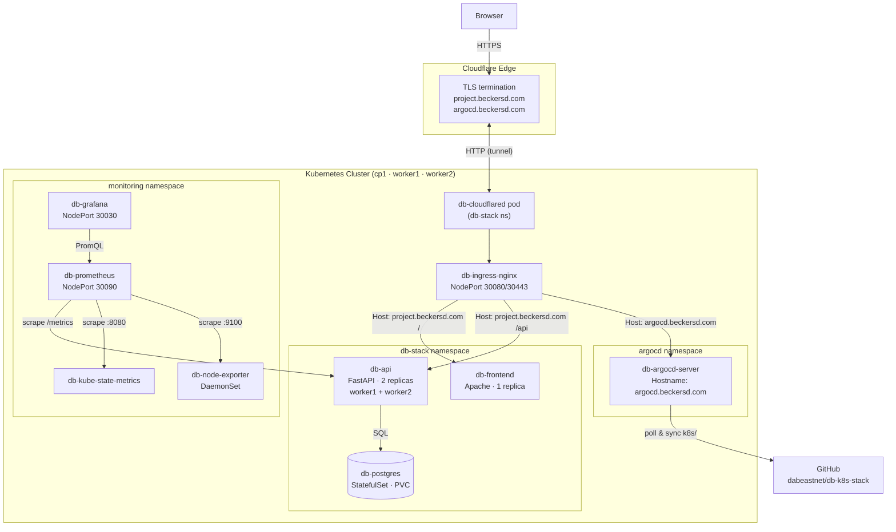

# db-k8s-stack

A production-minded three-tier web application deployed on a kubeadm Kubernetes cluster. Built for the Linux Web & Network Services assignment (Thomas More), achieving maximum scoring across all criteria including HTTPS, monitoring, multi-node load balancing, and GitOps.

## Project overview

The stack consists of:

- An **Apache HTTPD frontend** serving a JavaScript single-page application that displays a greeting with a name fetched live from the API and the current API container ID
- A **FastAPI backend** that reads a name from PostgreSQL, reports its container identity, and exposes Prometheus metrics
- A **PostgreSQL database** (StatefulSet with a PersistentVolume) seeded with a default name via Alembic migrations
- An **nginx ingress controller** routing external traffic into the cluster
- A **Cloudflare Tunnel** (`db-cloudflared`) providing public HTTPS access without port-forwarding or a static IP
- **Prometheus + Grafana + kube-state-metrics + node-exporter** for full cluster and application observability
- **ArgoCD** installed via Helm with a GitOps Application that continuously reconciles this repository onto the cluster
- A **Vagrant + VirtualBox** environment that builds the entire kubeadm cluster from scratch with a single `vagrant up`

## Architecture



**Traffic flow**:
1. Browser connects to Cloudflare over HTTPS; Cloudflare holds the TLS certificate
2. Cloudflare routes traffic to the `db-cloudflared` pod inside the cluster via an outbound tunnel
3. `db-cloudflared` forwards requests to the `db-ingress-nginx` controller
4. nginx routes to `db-frontend` (path `/`) or `db-api` (path `/api`) based on the `Host` header
5. The API queries PostgreSQL and returns JSON; Prometheus scrapes `/metrics` every 15 s
6. Grafana queries Prometheus for dashboards; ArgoCD polls GitHub and applies any manifest changes

**Local access** (Vagrant port-forwards on `cp1`):

| URL | Service |
|-----|---------|
| `http://localhost:18080` | Frontend via ingress (catch-all rule) |
| `http://localhost:19090` | Prometheus UI |
| `http://localhost:13000` | Grafana (`admin` / `admin`) |

## Repository structure

```
db-k8s-stack/
├── api/                    FastAPI backend (source + Dockerfile + migrations)
├── frontend/               Apache frontend (source + Dockerfile + httpd.conf)
├── k8s/                    Kubernetes manifests
│   ├── api/                API Deployment + Service
│   ├── frontend/           Frontend Deployment + Service
│   ├── postgres/           PostgreSQL StatefulSet + PV/PVC + Service
│   ├── ingress/            nginx Ingress rules
│   ├── cert-manager/       Let's Encrypt ClusterIssuers
│   ├── cloudflared/        Cloudflare Tunnel Deployment + Secret
│   ├── argocd/             ArgoCD Application manifest
│   └── monitoring/         Prometheus, Grafana, exporters
├── helm/                   Helm values files
├── vagrant/                Cluster provisioning scripts
├── docs/                   Architecture diagram, assignment reference
├── Vagrantfile             Three-node VirtualBox cluster definition
├── docker-compose.yml      Local development stack
├── build.sh                Build db-frontend and db-api images
├── push.sh                 Tag and push images to a registry
├── deploy-k8s.sh           Apply all Kubernetes manifests
├── deploy-local.sh         Start Docker Compose stack
├── test-local.sh           Smoke-test the Docker Compose stack
├── test-k8s.sh             Smoke-test the Kubernetes deployment
└── package.sh              Create db-k8s-stack.zip for submission
```

## Component README files

| Component | Path | Description | README |
|-----------|------|-------------|--------|
| FastAPI backend | `api/` | Python API with DB access, health checks, and Prometheus metrics | [README](api/README.md) |
| Apache frontend | `frontend/` | Static HTML/JS page served by Apache HTTPD | [README](frontend/README.md) |
| Kubernetes manifests | `k8s/` | All K8s resources: namespaces, deployments, services, ingress, secrets | [README](k8s/README.md) |
| Monitoring stack | `k8s/monitoring/` | Prometheus, Grafana, kube-state-metrics, node-exporter | [README](k8s/monitoring/README.md) |
| Helm values | `helm/` | ArgoCD Helm values; ingress-nginx install flags | [README](helm/README.md) |
| Vagrant cluster | `vagrant/` | Provisioning scripts for three-node kubeadm cluster on VirtualBox | [README](vagrant/README.md) |

## Getting started

### Prerequisites

- [Vagrant](https://www.vagrantup.com/) ≥ 2.3
- [VirtualBox](https://www.virtualbox.org/) ≥ 7.0
- ≥ 14 GB free RAM

### Spin up the full cluster

```bash
git clone https://github.com/dabeastnet/db-k8s-stack.git
cd db-k8s-stack
vagrant up
```

After provisioning completes (10–20 minutes depending on internet speed):

- Frontend: `http://localhost:18080`
- Prometheus: `http://localhost:19090`
- Grafana: `http://localhost:13000` (admin / admin)
- Public URL: `https://project.beckersd.com`
- ArgoCD: `https://argocd.beckersd.com`

### Local testing with Docker Compose

No Vagrant required:

```bash
./build.sh
docker compose up --build
# Frontend: http://localhost:8080
# API:      http://localhost:8000
```

See [LOCAL_TESTING.md](LOCAL_TESTING.md) for full test steps including name updates and auto-refresh.

### Kubernetes smoke test

With a running cluster and `kubectl` configured:

```bash
./test-k8s.sh
```

Port-forwards the API and frontend, then exercises all endpoints.

## Building and publishing images

```bash
# Build locally
./build.sh

# Push to a registry
export REGISTRY=ghcr.io/dabeastnet
./push.sh
```

The Kubernetes Deployments reference `ghcr.io/dabeastnet/db-api:v6` and `ghcr.io/dabeastnet/db-frontend:v3`.

## Updating the name in the database

In a running Kubernetes cluster:

```bash
export DB_USER=demo DB_NAME=demo DB_PASSWORD=demo
./vagrant/scripts/update_name.sh "Alice"
```

Refresh the browser and the name updates immediately.

## GitOps workflow

ArgoCD (`db-argocd`) monitors the `k8s/` directory of this repository and automatically applies any changes:

1. Edit a manifest in `k8s/`
2. Commit and push to `main`
3. ArgoCD detects the change within ~3 minutes and applies it to the cluster

Apply the ArgoCD Application manifest once after provisioning to activate sync:

```bash
kubectl apply -f k8s/argocd/application.yaml
```

Retrieve the initial ArgoCD admin password:

```bash
kubectl -n argocd get secret argocd-initial-admin-secret \
  -o jsonpath="{.data.password}" | base64 -d && echo
```

## Security practices

- **Non-root containers** — frontend and API run as UID 1001; PostgreSQL runs as UID 999 (default)
- **Minimal base images** — `httpd:2.4-alpine`, `python:3.11-slim`, `postgres:16-alpine`
- **Secrets management** — database credentials in Kubernetes Secrets; `secret.example.yaml` is a template only
- **Resource limits** — all pods have CPU and memory requests and limits defined
- **Health probes** — liveness and readiness probes on all application pods; unhealthy pods restart automatically
- **TLS** — Cloudflare handles public TLS; cert-manager ClusterIssuers are defined for optional Let's Encrypt integration

## Packaging for submission

```bash
./package.sh
# Produces: db-k8s-stack.zip
```

Excludes `.git`, `*.pyc`, `__pycache__`, and `vendor/`.

## Requirement-to-implementation mapping

| Assignment requirement | Implementation |
|------------------------|----------------|
| Three containers: Apache, FastAPI, PostgreSQL | `frontend/`, `api/`, `k8s/postgres/postgres.yaml` |
| JavaScript page from provided gist | `frontend/src/index.html` |
| Automatic layout refresh | `version.txt` polling in `index.html`; `frontend/static/version.txt` |
| `/api/name` endpoint | `api/app/main.py` |
| `/api/container-id` endpoint | `api/app/main.py` |
| Name change reflected on page refresh | `vagrant/scripts/update_name.sh` |
| Health check with automatic restart | Liveness/readiness probes in `k8s/api/deployment.yaml` |
| HTTPS via cert-manager | `k8s/cert-manager/clusterissuer.yaml` (TLS via Cloudflare active; cert-manager optional) |
| Prometheus monitoring | `k8s/monitoring/`, `/metrics` endpoint in API |
| kubeadm cluster: 1 control plane + 2 workers | `Vagrantfile`, `vagrant/provision-master.sh` |
| API load balanced across nodes | `topologySpreadConstraints` in `k8s/api/deployment.yaml` |
| ArgoCD via Helm | `helm/argocd-values.yaml`, `k8s/argocd/application.yaml` |
| GitOps workflow | ArgoCD Application auto-syncs from `dabeastnet/db-k8s-stack` |
| `db-` prefix on all images and pod names | All custom images and K8s resource names prefixed with `db-` |
| Documentation + PDF | This README, `LOCAL_TESTING.md`, `docs/submission.pdf` |
| ZIP submission | `package.sh` → `db-k8s-stack.zip` |

## Troubleshooting

**Pods stuck in `Pending`** — Workers may not have joined yet. Check with `kubectl get nodes`. If `worker2` is missing, run `vagrant up worker2`.

**Cross-node traffic failing / DNS errors** — Flannel may be on the wrong interface. Verify with `bridge fdb show dev flannel.1`; entries should show `dst 192.168.56.x`, not `10.0.2.x`. If wrong, re-provision cp1.

**ArgoCD not syncing** — Confirm the Application is applied (`kubectl get application -n argocd`) and the GitHub repository is publicly accessible.

**Cloudflare tunnel errors** — Check `kubectl logs -n db-stack -l app=db-cloudflared`. If the origin URL shows `localhost:18080`, update the Cloudflare tunnel dashboard to use `http://db-ingress-nginx-controller.ingress-nginx.svc.cluster.local`.

**Worker join timeout on `vagrant up`** — The `provision-worker.sh` poll loop retries every 5 s. If it still fails, wait for cp1 to finish and run `vagrant provision worker1 worker2` separately.
