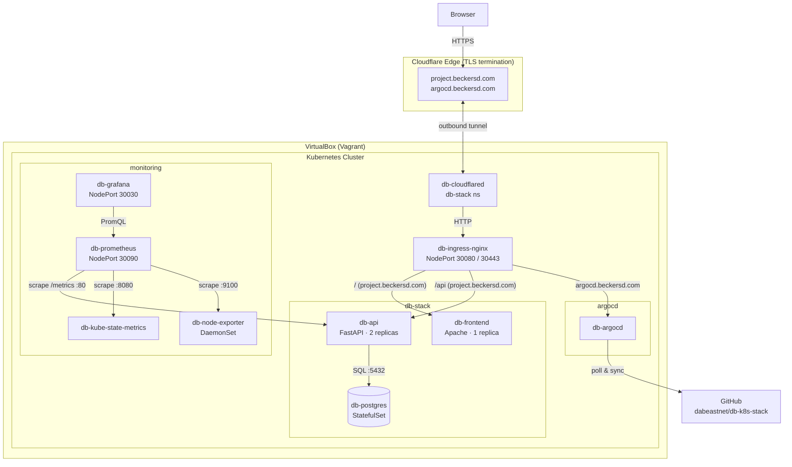

# Architecture

This document describes the architecture of db-k8s-stack and the interactions between its components.

## System diagram



## Components

### Browser
End users access the application at `https://project.beckersd.com`. Cloudflare holds the TLS certificate; no certificate management is required inside the cluster for public traffic.

### Cloudflare Edge
Terminates HTTPS and routes traffic to the cluster through an outbound Cloudflare Tunnel. No inbound firewall rules or static public IPs are needed. Two public hostnames are configured in the Cloudflare dashboard:

| Hostname | Routes to |
|----------|-----------|
| `project.beckersd.com` | `http://db-ingress-nginx-controller.ingress-nginx.svc.cluster.local` |
| `argocd.beckersd.com` | `http://db-ingress-nginx-controller.ingress-nginx.svc.cluster.local` |

### db-cloudflared (db-stack namespace)
A single pod running `cloudflare/cloudflared:latest` that maintains the outbound tunnel to Cloudflare. The tunnel token is stored in the `db-cloudflared-token` Secret. All inbound public traffic enters the cluster through this pod.

### db-ingress-nginx (ingress-nginx namespace)
nginx ingress controller installed via Helm (release `db-ingress-nginx`). Exposes NodePorts 30080 (HTTP) and 30443 (HTTPS). Routes requests to the correct backend service based on the `Host` header and URL path:

- `Host: project.beckersd.com`, path `/api*` → `db-api:80`
- `Host: project.beckersd.com`, path `/` → `db-frontend:80`
- `Host: argocd.beckersd.com` → `db-argocd-server:80`
- No-host catch-all → same as `project.beckersd.com` (for local access via `localhost:18080`)

### db-frontend (db-stack namespace)
Apache HTTPD serving `index.html`. The JavaScript page makes two `fetch` calls on load (`/api/name`, `/api/container-id`) and updates the DOM. A polling loop checks `version.txt` every 15 s and reloads the page if the version string changes.

### db-api (db-stack namespace)
FastAPI application running behind Uvicorn. Two replicas are spread across `worker1` and `worker2` by a `topologySpreadConstraints` rule. On startup the Alembic migration ensures the `person` table exists and is seeded. Key endpoints:

| Endpoint | Description |
|----------|-------------|
| `GET /api/name` | Returns name from `person` table in PostgreSQL |
| `GET /api/container-id` | Returns container ID (parsed from `/proc/self/cgroup`) and pod metadata |
| `GET /healthz` | Liveness probe — always 200 |
| `GET /readyz` | Readiness probe — runs `SELECT 1`, returns 503 if DB unreachable |
| `GET /metrics` | Prometheus exposition; exposes `db_api_requests_total` counter |

### db-postgres (db-stack namespace)
PostgreSQL 16 running as a StatefulSet with a hostPath PersistentVolume (`/mnt/postgres-data` on the node). Only the API has network access to this service (ClusterIP).

### Monitoring (monitoring namespace)

| Component | Role |
|-----------|------|
| `db-prometheus` | Scrapes API, kube-state-metrics, and all nodes (node-exporter); NodePort 30090 |
| `db-grafana` | Dashboard UI with pre-provisioned Prometheus datasource and overview dashboard; NodePort 30030 |
| `db-kube-state-metrics` | Exports Kubernetes object state metrics (pod phases, node conditions, restart counts) |
| `db-node-exporter` | DaemonSet exporting CPU, memory, disk I/O per node |

### db-argocd (argocd namespace)
ArgoCD installed via Helm (release `db-argocd`) with `--insecure` mode so nginx can proxy it over plain HTTP. The `db-app` ArgoCD Application watches the `k8s/` directory of this repository and applies changes automatically (prune + self-heal enabled).

### GitHub
The authoritative source for Kubernetes manifests. ArgoCD polls it on a schedule (default ~3 minutes) and reconciles any drift between the repository and the cluster state.

## Data flow

1. User visits `https://project.beckersd.com` → Cloudflare terminates TLS
2. Cloudflare sends plain HTTP to the `db-cloudflared` pod via the tunnel
3. `db-cloudflared` forwards to `db-ingress-nginx` on port 80
4. nginx routes `/` to `db-frontend`, `/api` to `db-api`, based on `Host: project.beckersd.com`
5. The browser loads `index.html` and JavaScript calls `GET /api/name` and `GET /api/container-id`
6. `db-api` queries PostgreSQL for the name; parses `/proc/self/cgroup` for the container ID
7. Prometheus scrapes `db-api:80/metrics` on a 15 s schedule; Grafana queries Prometheus for dashboards
8. ArgoCD polls GitHub; any committed change to `k8s/` is applied within ~3 minutes

## Provisioning flow

```
vagrant up
  ├── cp1: provision-common.sh  (swap, containerd, k8s packages)
  │   provision-master.sh
  │     kubeadm init
  │     Flannel CNI (patched to enp0s8)
  │     Helm install db-ingress-nginx
  │     Helm install db-argocd
  │     Generate join.sh
  │     kubectl apply (namespace, configmap, secret, postgres, api, frontend, ingress)
  │     deploy-k8s.sh (monitoring, cloudflared, argocd application)
  │
  ├── worker1: provision-common.sh
  │   provision-worker.sh
  │     wait for 192.168.56.10:6443
  │     kubeadm join
  │
  └── worker2: provision-common.sh
      provision-worker.sh
        wait for 192.168.56.10:6443
        kubeadm join
```
