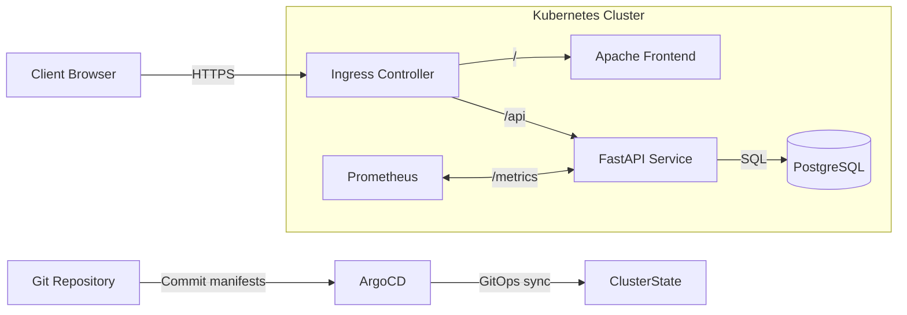

# Architecture diagram and explanation

This document provides an overview of the db‑k8s‑stack architecture and the interactions between its components.  The diagram below is rendered using Mermaid.  You can view it directly on GitHub or copy it into a Mermaid renderer.

### Components

* **Client Browser** – A user’s web browser requests the site over HTTPS.  The TLS certificate is issued by Let’s Encrypt through cert‑manager and stored as a Kubernetes secret consumed by the ingress.
* **Ingress Controller** – An nginx ingress that routes traffic based on the URL path.  It forwards requests with the `/api` prefix to the FastAPI service and all other requests to the Apache frontend.  The ingress terminates TLS and communicates with the services over the cluster network.
* **Apache Frontend** – A simple HTTP server that serves the static `index.html`, CSS and JavaScript files.  It does not require any backend connectivity, other than to fetch data from the API.
* **FastAPI Service** – A containerised Python application that implements the REST API.  It connects to PostgreSQL using SQLAlchemy, exposes Prometheus metrics and provides health and readiness endpoints used by Kubernetes probes.  Multiple replicas of this deployment are created to scale out the API and provide fault tolerance.
* **PostgreSQL** – The relational database running as a Kubernetes StatefulSet with a persistent volume.  It stores the `person` table that holds a single row representing the user’s name.  Alembic migrations manage the schema and seed the table.  Only the API has network access to this service.
* **Prometheus** – Part of the kube‑prometheus‑stack.  It scrapes the API’s `/metrics` endpoint via the ServiceMonitor resource and stores time‑series metrics such as request counts.  These metrics are used to observe application performance and health.
* **ArgoCD** – A GitOps controller installed via Helm.  It monitors a Git repository containing the Kubernetes manifests (this repository) and continuously reconciles the desired state with the actual cluster state.  Any changes merged into Git are automatically applied to the cluster.

### Data flow

1. A user’s browser resolves the domain (e.g. `app.example.com`) to the ingress controller’s IP and establishes an HTTPS connection.
2. The ingress decrypts the traffic using a certificate managed by cert‑manager and forwards the request to either the frontend or the API based on the path.
3. The frontend loads the static HTML page and uses JavaScript `fetch` calls to request `/api/name` and `/api/container-id`.  The responses are JSON objects containing the current name in the database and the container identifier.
4. The API queries PostgreSQL for the name and returns it.  It also parses `/proc/self/cgroup` to extract the container ID and includes `pod_name` and `hostname` fields from the Kubernetes downward API.
5. Prometheus scrapes the API’s `/metrics` endpoint on a schedule defined in the ServiceMonitor.  Metrics are stored for alerting and observability.
6. ArgoCD monitors the Git repository and applies any changes to the Kubernetes manifests.  This ensures configuration drift is corrected and simplifies deployments.